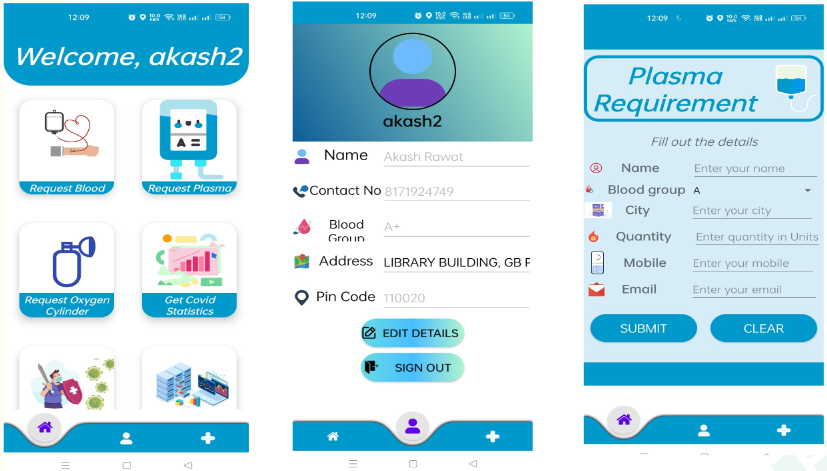

## About the application - Lifeline 
The application aims to provide medical facility to the patients in various emergency conditions such as urgent need of blood, plasma, oxygen cylinders.
A notification is sent to the nearby users for helping the patient when in need. 

## Motivation
• In the covid times, many people lost their family members due to lack of medical facilities.\
• There was a massive shortage of oxygen cylinders, plasma and blood with the required blood group.So, there was a need of some technological advancement which could solve this massive reach.

## Features proposed and Implemented
• The user needs to enter his/her information in the application with his location and this data gets stored in the app’s database. \
• If there is an emergency condition in which a patient needs help like blood, plasma, oxygen cylinder, etc then the notification is sent to the nearby users (in the nearby radius) on their mobile phones so that they can reach out for help. \
• Multiple users can reach out for help, so as soon as the patient gets a confirmation from any of the users for the help then  the other users are notified that the patient has got the help so that multiple users may not reach out for help. \
• As soon as the patient registers for help, the location of that patient is sent to the user going to help that patient. And the helper will be directed to the google maps to reach that location of the patient.

## Screenshots

  

## Challenges faced
• The real time tracking of the user going to help the patient is used with the help of google maps and not with any inbuilt API of our application.\
• Till now there is no connection built via the blood donation organisations for the patient, so if there is no donor present overall then it will be difficult to help the patient.\
• If there is no one within the radius of the patient then the patient might not find a helper in emergency.

## Future work
• If there is no one in the radius of the patient, then the range of radius should automatically increase so that notification for help could be sent to the next nearby users.\
• More medical details of the patient can be present in the application for future use.\
• The application can be further extended to other use cases such as booking an appointment with the doctor, delivery of medicines at the required location.

## Contribution
• **[Akash Rawat](https://github.com/akashrwt7)**, **[Shubham Rana](https://github.com/rana11shubham)**: Send notification to the users within the defined radius, sending the patient’s details by fetching via database updating the request by the receiver if he could help or not, Live covid statistics, UI of the register and login pages, Covid symptoms test activity to check if the user has to go for RT PCR or not, form validation.\
• **Dhiraj Jain**: Register/login form validation, Database for the user profile, firebase integration, GPS integration, all form validations.\
• **[Adarsh Singh Kushwah](https://github.com/adarshkushwah21111)**, **[Charisha Phirani](https://github.com/Cp21117)**: User profile page, home screen, bottom menu for the home screen, forms for various functionalities such as blood and plasma donation, tracking the live location of the donor to receiver and directing the activity to google maps, developers details.

